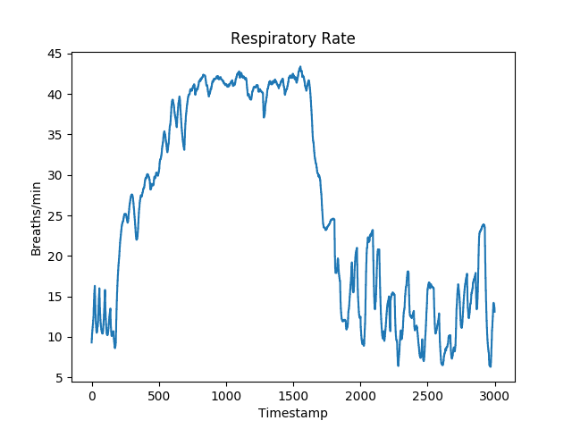
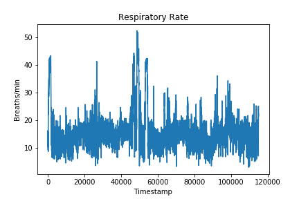

# Respiratory-Rate-Estimation

## Project description
This project aims to predict the respiratory rate of an individual which is a time-series data with temporal dependence. 

## Data
The data provided is the accelerometer data worn by the individual on the wrist and the ankle. An EDA is performed on this data and 52 features are provided as the input. 

A sample part of the respiratory curve is shown below:

The entire respiratory rate available from the data is spread across time as shown:

## Approach

