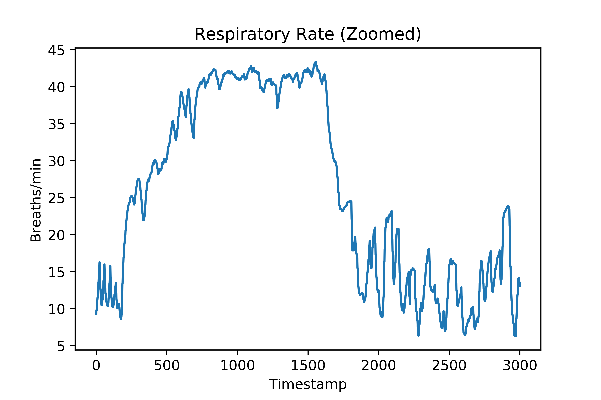
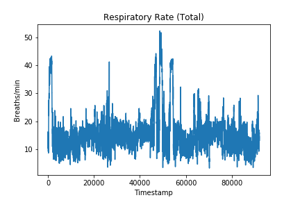
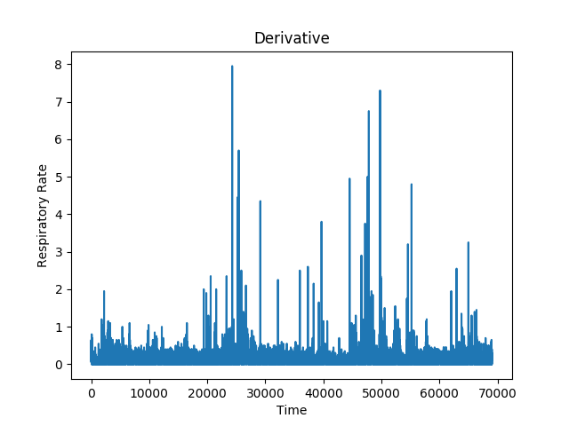
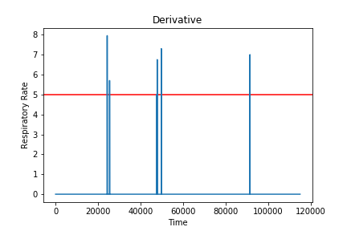
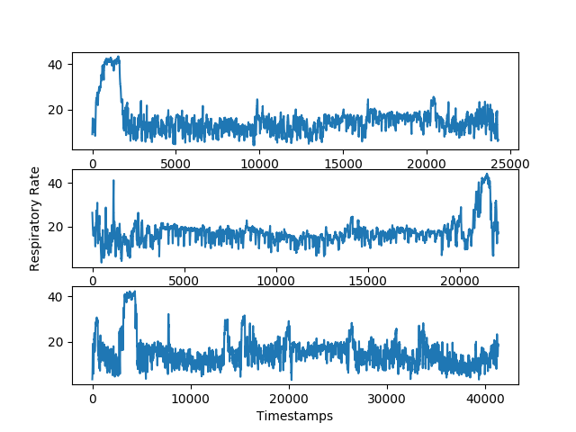

# Respiratory-Rate-Estimation

## Project description
This project aims to predict the respiratory rate of an individual which is a time-series data with temporal dependence. 
The following parts explain characterstics of the data and various pre-processing techniques used to remove noise and clean the data. The learning model used is a Recurrent Neural Network using LSTMs.

## Libraries used
* **Tensorflow** (for Machine Learning)
* **Pandas** (for File Handling)
* **Scikit-learn** (for Pre-processing)

## Data
The data provided is the accelerometer data worn by the individual on the wrist and the ankle. An EDA is performed on this data and 52 features are provided as the input. 

A sample part of the respiratory curve is shown below:

  

The entire respiratory rate available from the data is spread across time as shown:

   

## Approach

### Data Pre-processing

We observe that there are spikes occurring in the dataset due to noisy measurements. So to remove the noise, we take the absolute first order derivative to see the amount of variations in consecutive time steps. The absolute first order derivative looks like this:

   

As seen in the figure, at some timesteps, the rise in the respiratory rate is unrealistic. To mark down these values, we set a threshold on the change in values. If the rise is higher than this threshold, the user has possibly changed the action drastically or the sensor reading has acquired noise. The thresholded first order derivative is shown below (threshold value = 5):

   

We can now use the timestamps, to divide our training dataset into 3 different sets. We will train the model on each of the sets individually.
The 3 sets are shown below:

   

### Dimensionality 
The data in the CSV files consists of the raw accelerometer values, gyroscpoe values both from wrist and ankle, along with the body temperature, the environmental temperature, the heart-rate followed by a various statistics from these features such as Variances, Covariances, Skewness, Kurtosis etc.  
In total, there are 52 total dimensions to chacterize the respiratory-rate value. Since, we need not use all the 52 features, we use Dimensionality Reduction to reduce the number of computations. We first run PCA keeping all the 52 features and calculate the variances of each of the 52 components. The **total variance** is the sum of variances of all individual components. The fraction of **variance explained** by a principal component is the ratio between the variance of that principal component and the total variance. We use the "explained variance ratio" attribute provided by sklearn to know the contribution of each of the components and choose the top k components that explain most of the data.  
In our case, we choose a threshold of 1e-5 and only choose those components, whose explained variance ratio is greater than this value. The total number of components we chose is 10.  
So now, our input feature vector becomes a 10 Dimensional vector. 
